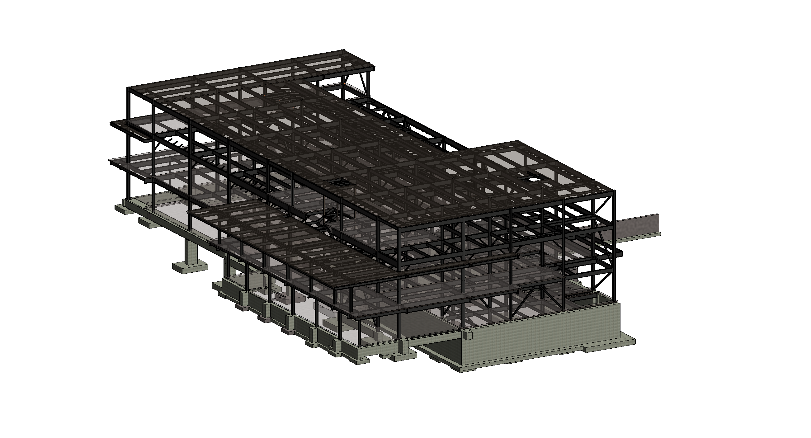

# Umass Worcester Dining Common

This project showcases the BIM modeling and RAM modeling 3D results of the new construction of University of Massachusetts' dining Hall. Located in the Northeast Residential Area, Worcester Commons is one of the most popular dining facilities on campus.

*Scroll down for video link*

## Video

https://www.umass.edu/newsoffice/article/umass-dining%E2%80%99s-new-worcester-commons-opens

